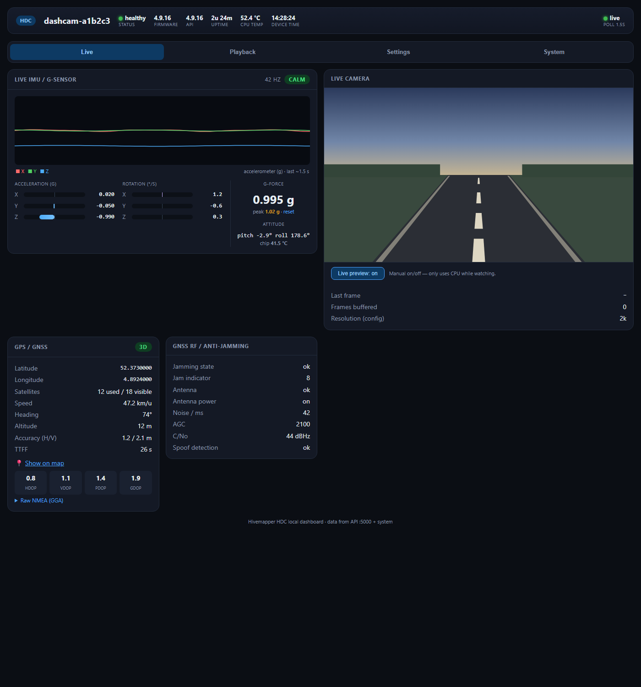
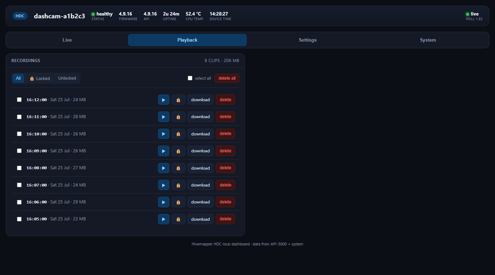
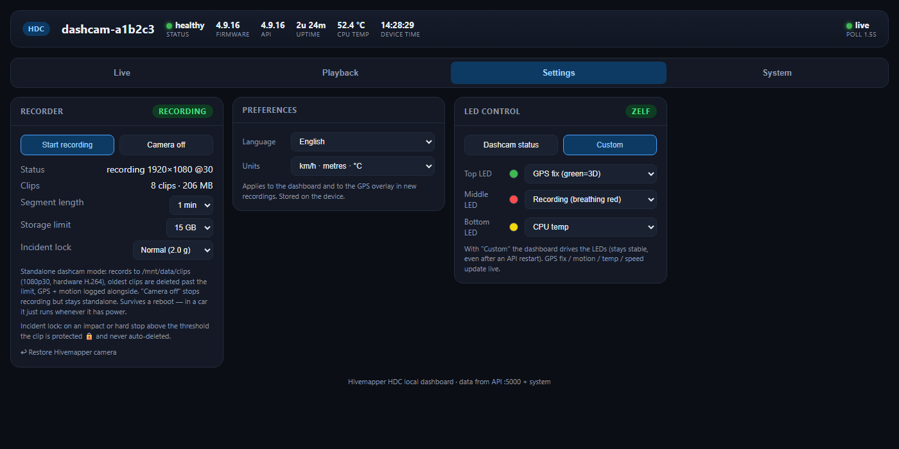
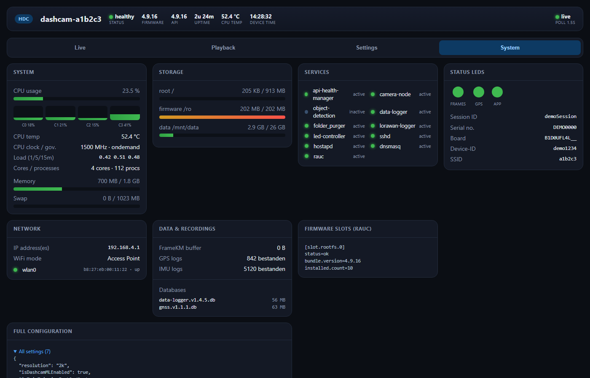

# Roamcam

**Je Hivemapper-dashcam die voor jóu werkt in plaats van voor het netwerk.**

De Hivemapper HDC is een mooi doosje: een Raspberry Pi Compute Module 4, een 12&nbsp;MP Sony-sensor, GPS, een versnellingsmeter, drie RGB-LEDs. Standaard bestaat hij voor één ding — de kaart van Hivemapper. Roamcam maakt er een gewone, privé, offline **dashcam** van die alleen naar jou luistert.

Geen account. Geen cloud. Geen crypto. Hij stuurt nooit iets naar buiten. Alles draait op het toestel zelf en verschijnt in een strak webdashboard dat je opent op je telefoon of laptop.

> Gemaakt in Nederland 🇳🇱, voor iedereen met zo'n camera in een la.

### 🖥️ Probeer het zonder de hardware

Open **[`demo.html`](demo.html)** in een browser (downloaden, of de repo klonen en dubbelklikken) om door het hele dashboard te klikken met voorbeelddata — elk tabblad, live, zonder toestel. De snelste manier om te zien wat je krijgt.

### 📸 Screenshots

<p>
  
  
</p>
<p>
  
  
</p>

*Allemaal met de voorbeelddata uit `demo.html` — demo-locatie (Amsterdam), nep-toestel-ID's. Nooit een echt toestel of een echte locatie.*

---

## Wat je krijgt

- **Loop-opname** naar de interne opslag — 1080p30, via de hardware-H.264-encoder van de Pi, dus het kost bijna geen CPU. Clips zijn `.mp4`-bestanden met tijdstempel die je overal afspeelt.
- **Een live webdashboard** op `http://<ip-van-toestel>:8080` — camerabeeld, sensoren, opnames, instellingen, systeemstatus. Geen app nodig.
- **Echte GPS & een echte G-sensor.** De u-blox geeft positie, snelheid, koers en satellietstatus; de IMU geeft een live accelerometer/gyro-uitlezing met oscilloscoop en schokdetectie.
- **De klok zet zichzelf uit GPS.** Geen internet of batterijklok nodig — zodra er een fix is, kloppen de tijdstempels.
- **De drie status-LEDs zijn van jou.** Kies per LED een functie: GPS-fix, beweging, CPU-temperatuur, snelheid, een vaste kleur, of een langzaam *ademend* rood dat aangeeft dat hij opneemt.
- **Automatisch opruimen.** Stel een opslaglimiet in; de oudste clips worden gewist om ruimte te maken. Instellen en vergeten, precies als een echte dashcam.
- **Incident-lock.** Een klap of noodstop boven jouw G-drempel beschermt die clip automatisch 🔒 — die wordt nooit overschreven door de loop. Je kunt clips ook met de hand vergrendelen.
- **Engels of Nederlands, metrisch of imperiaal.** Zet de hele interface om tussen EN/NL en tussen km/u·m·°C en mph·ft·°F. De GPS-overlay in nieuwe opnames volgt je keuze.
- **Live meekijken, op aanvraag.** Tijdens het opnemen wordt de camera normaal met rust gelaten (0% extra CPU) — zet "Live preview" aan in de Live-tab om mee te kijken, via de hardware-decoder van de Pi voor een laagresolutie-beeld. Staat elke keer dat je het dashboard opent standaard *uit*, en schakelt zichzelf uit zodra je de Live-tab verlaat — draait dus nooit onbeheerd door.
- **Hij start gewoon.** Geef 'm stroom en hij begint meteen op te nemen — ideaal om in een auto te bouwen. Overleeft reboots, geen login, geen knop.

Hij is licht: het dashboard zit rond de 0–6% van één CPU-core en ~28&nbsp;MB geheugen.

---

## Wat je nodig hebt

- Een **Hivemapper HDC** dashcam (het model op basis van de Raspberry Pi CM4). Root-SSH staat standaard open op deze toestellen — dat maakt dit mogelijk.
- De camera en je computer op hetzelfde netwerk. De HDC zet zelf een wifi-accesspoint op (`dashcam`), of je hangt 'm aan je LAN.
- Vijf minuten.

> Dit is gebouwd en getest op de **HDC**. De nieuwere *Bee* draait andere firmware en wordt nog niet ondersteund — zie [docs/HARDWARE.md](docs/HARDWARE.md).

---

## Snel starten

SSH naar de camera (standaard gebruiker `root`, geen wachtwoord) en draai:

```sh
# vanaf je computer, kopieer de twee bestanden
scp dashboard_server.py install.sh root@192.168.0.10:/tmp/

# dan op de camera
ssh root@192.168.0.10
cd /tmp && sh install.sh
```

Klaar. Open `http://192.168.0.10:8080` en je kijkt naar je eigen dashcam.

De installer zet de app op de persistente opslag, haakt 'm in het opstartproces zodat hij na elke stroomonderbreking terugkomt, en start 'm. Volledige uitleg met plaatjes: **[docs/INSTALL.md](docs/INSTALL.md)**.

---

## Hoe het werkt (kort)

De rootschijf van de HDC is read-only (squashfs) met een RAM-overlay, dus normaal overleeft niks een reboot. Roamcam werkt daar *mee* in plaats van ertegen:

- De app en instellingen staan op `/mnt/data`, de enige partitie die blijft.
- De autostart haakt in het eigen opstartproces van de camera, dus het dashboard komt bij elke start vanzelf op — geen systemd-service die verdwijnt, geen handmatige stap.
- Opnemen neemt de camera netjes over en geeft 'm terug als je stopt. De GPS en autostart blijven de hele tijd draaien.

Er is niks te compileren. Het is één Python-bestand van ~1300 regels dat alleen de standaardbibliotheek gebruikt, plus de `libcamera`- en `ffmpeg`-tools die al op het toestel staan. Lees het, pas het aan, sloop het — het is van jou.

---

## Het dashboard

| Tab | Wat erin zit |
|-----|--------------|
| **Live** | Camerabeeld, GPS/GNSS, RF- & anti-jamming-telemetrie, en een live IMU-oscilloscoop met G-piek |
| **Terugkijken** | Je clips als nette lijst — afspelen, downloaden, vergrendelen, filteren, meerdere selecteren en in bulk wissen |
| **Instellingen** | Opname start/stop, segmentlengte, opslaglimiet, en functies per LED |
| **Systeem** | CPU, temperatuur, geheugen, opslag, services, netwerk, firmware-slots, volledige config |

---

## Veiligheid en de wet

Dit is een hobbyproject, gedeeld zoals het is. Een paar eerlijke opmerkingen:

- Dashcam-regels verschillen per land — filmen, geluid, waar je 'm mag monteren en wat je mag delen. Check je lokale regels. (Dit toestel heeft **geen microfoon**, dus alleen beeld.)
- Een embedded apparaat aanpassen heeft altijd enig risico. Roamcam raakt bewust de firmware niet aan, juist daarom, maar je draait het op eigen risico.
- Monteer 'm zo dat hij nooit je zicht blokkeert of bij een botsing een projectiel wordt.

---

## Steun dit project ❤️

Ik bouw dit in mijn vrije tijd en geef het gratis weg. Als Roamcam je een dashcam heeft bespaard, of je vindt het gewoon leuk, dan helpt sponsoren echt en houdt het de ontwikkeling gaande:

**[❤️ Sponsor op GitHub](https://github.com/sponsors/Menno000)**

Er staat ook een **Sponsor**-knop bovenaan deze repo.

---

## Met dank & licentie

Gebouwd door een Nederlandse sleutelaar die een prima camera niet wilde laten verstoffen. Niet gelieerd aan of goedgekeurd door Hivemapper.

Uitgebracht onder de [MIT-licentie](LICENSE) — doe ermee wat je wilt, zonder garantie.
